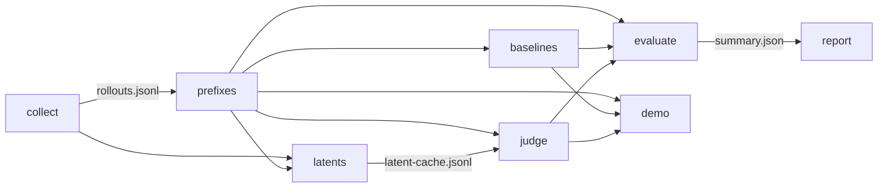

<div align="center">

# LeWorldModel Judge

**A world model as a judge: early, auditable verdicts on partial robot-manipulation rollouts.**

[](https://github.com/AbdelStark/leworldmodel-judge/actions/workflows/ci.yml)
[](pyproject.toml)
[](LICENSE)

[](docs/paper/leworldmodel-judge.pdf)
[](https://huggingface.co/datasets/abdelstark/leworldmodel-judge-runs)
[](artifacts/)

</div>

Sparse reward says nothing useful about a trajectory until it is over. This project asks a
narrow, benchmarkable question: can a world-model-derived surprise signal judge a partial
rollout earlier (still on track, already doomed, physically implausible, or too uncertain to
call) and beat sparse reward on false positives and ranking? Everything here is built so a
skeptical reviewer can answer that question from checked-in files alone: every verdict
decomposes into named evidence, every number carries its `judge_mode` and threshold
provenance, and every artifact regenerates from a pinned command line.

**Companion paper:** [A World Model as a Judge: Early, Auditable Verdicts on Partial
Robot-Manipulation Rollouts](docs/paper/leworldmodel-judge.pdf) (sources and build in
[docs/paper/](docs/paper/); every figure regenerates from the checked-in artifacts).

## The idea

The benchmark slice is locked: Meta-World `reach-v3`, `push-v3`, `pick-place-v3`, prefixes cut
at 0.25/0.50/0.75 of the episode horizon, stress-tested with explicit policy families
(`expert`, `weak`, `doomed`, `misleading`). A fifth family, `random`, exists in the collector
as a negative control; its earlier run lives in git history, and the checked-in artifacts
cover the four families above.

The shipped judge is a composite heuristic over decomposed prefix evidence (progress, distance,
grasp, reward density, stall), plus a hybrid mode that adds an observation-space latent proxy:
mean-pooled observation windows with a linear-extrapolation predictor, scored against the
realized post-cutoff observations. The hybrid signal is replay-time, for completed episodes,
not a cutoff-time verdict (see
[docs/method.md](docs/method.md#cutoff-time-vs-replay-time-judging)). All of it is
JEPA-anchored in thesis, not JEPA-faithful in implementation: there is no learned encoder and
no trained latent dynamics model yet. Every scored row carries a `judge_mode` field, so no
number can hide which judge produced it.

Auditability is the point. Every verdict decomposes into raw sub-scores, serialized as JSONL
and CSV, replayable per episode and per prefix. Summary files state whether the failure
threshold was fixed, tuned in-slice, or calibrated on a held-out family split, and they name
the calibration and evaluation cohorts. A reviewer can challenge any score by reading the
rollout, the prefix record, and the evidence fields, without rerunning anything.

## Pipeline



## Quickstart

```bash
uv sync   # the default dev group includes matplotlib; pip/wheel installs need the viz extra for PNG plots, else SVG fallback

# 1. Collect synthetic rollouts for the locked task trio across four policy families
uv run lewm-judge collect --source synthetic --task all --episodes 5 \
  --policy-family expert,weak,doomed,misleading --output out/rollouts.jsonl

# 2. Slice into prefixes at 0.25 / 0.50 / 0.75 of the horizon
uv run lewm-judge prefixes --input out/rollouts.jsonl --output out/prefixes.jsonl

# 3. Build the observation-space latent cache
uv run lewm-judge latents --rollouts out/rollouts.jsonl --prefixes out/prefixes.jsonl \
  --output out/latent-cache.jsonl

# 4. Score baselines and the judge on the same records (hybrid mode exercises the full pipeline;
#    it replays completed episodes; the cutoff-time judge is --mode heuristic_surprise)
uv run lewm-judge baselines --input out/prefixes.jsonl --output out/baselines.jsonl
uv run lewm-judge judge --input out/prefixes.jsonl --latent-cache out/latent-cache.jsonl \
  --mode hybrid_surprise --output out/judge.jsonl

# 5. Evaluate baselines vs judge on the full slice (in-slice threshold)
uv run lewm-judge evaluate --prefixes out/prefixes.jsonl --baselines out/baselines.jsonl \
  --judge out/judge.jsonl --output out/summary.json

# 6. Render the family report and the replay/demo bundle
uv run lewm-judge report --summary out/summary.json --output-dir out/report
uv run lewm-judge demo --prefixes out/prefixes.jsonl --baselines out/baselines.jsonl \
  --judge out/judge.jsonl --families expert,misleading --output out/demo-artifact.md
```

Everything lands where `--output`/`--output-dir` point: JSONL rows, the summary JSON,
`family-report.md` plus a plot in the report dir, and a markdown demo artifact with sibling files
(`<stem>-comparison.csv`, `<stem>-score-replay.csv`, `<stem>-push-v3-hard-disagreement-pack.csv`,
`<stem>-timeline.png|.svg`). The checked-in runs under `artifacts/` are exactly these files,
produced with `--source metaworld` for the real run.

The walkthrough evaluates in-slice because on this synthetic data a held-out family split
(calibrate on `weak`+`doomed`, evaluate on `expert`+`misleading`) leaves zero failure labels in
the evaluation slice, so the evaluation metrics would honestly come back `null`. The real
held-out invocation is in [docs/benchmark.md](docs/benchmark.md#reproduction).

### Run it on Hugging Face Jobs

The same pipeline runs unchanged on [Hugging Face Jobs](https://huggingface.co/docs/huggingface_hub/en/guides/jobs)
([RFC-011](docs/rfcs/RFC-011-hf-jobs-pipeline.md)): a launcher pins the job's install to your
pushed commit, the job publishes the complete run folder (capture of record, both judge
outputs, reports, and a `provenance.json` with per-stage commands, timings, and checksums) to
[`abdelstark/leworldmodel-judge-runs`](https://huggingface.co/datasets/abdelstark/leworldmodel-judge-runs),
and a deterministic verify gate re-checks the published contract.

```bash
uv run jobs/launch.py launch --preset smoke                # end-to-end sanity, cpu-basic
uv run jobs/launch.py launch --preset synthetic-benchmark  # 50 episodes/(task,family)
uv run jobs/launch.py launch --preset metaworld-benchmark  # fresh real capture, cpu-upgrade
```

See [jobs/README.md](jobs/README.md), including the scoped
[ml-intern](https://github.com/huggingface/ml-intern) operator/reviewer steps.

## Results

Real Meta-World, held-out family split. All numbers from
[`artifacts/hard-family-real-held-out-2026-04-28/summary-composite.json`](artifacts/hard-family-real-held-out-2026-04-28/summary-composite.json),
the prefix-only composite judge, which reads nothing past the cutoff.

| Metric (evaluation slice, n=18) | Judge (composite) | Sparse-reward baseline | Progress baseline |
|---|---:|---:|---:|
| Failure hit rate | 1.00 | 1.00 | 1.00 |
| False positive rate | **0.10** | 1.00 | 1.00 |
| Pairwise ranking accuracy (= AUROC) | **1.00** | 0.50 | 0.556 |
| Average precision | **1.00** | 0.444 | 0.485 |

Threshold provenance: `judge_failure_threshold` 0.298006, calibration mode
`held_out_family_split`, calibrated only on `weak`+`doomed` (9 failure / 9 non-failure prefixes),
evaluated only on `expert`+`misleading` (8 failure / 10 non-failure), `family_overlap: false`.
Judge rows (`judge-composite.jsonl`) record `judge_mode: composite_prefix_judge` (CLI
`--mode heuristic_surprise`).

Calibration is asymmetric by design: only the judge threshold is calibrated; the progress
baseline keeps its fixed default (`progress_failure_threshold` 0.2, mode
`fixed_progress_baseline`) and the sparse signal is binary. The ranking and average-precision
rows are threshold-free and therefore calibration-fair; the false-positive row compares a
calibrated judge operating point against uncalibrated baseline defaults.

The hybrid replay-time variant
([`summary.json`](artifacts/hard-family-real-held-out-2026-04-28/summary.json), threshold
0.311141, `judge_mode: hybrid_prefix_latent_judge`) reproduces this table exactly. Its
latent-mismatch feature is computed against post-cutoff observations by construction, so it is a
replay/triage signal for completed episodes, not a cutoff-time verdict; see
[docs/method.md](docs/method.md#cutoff-time-vs-replay-time-judging).

Read the table with these caveats:

- The evaluation slice is 18 prefixes from 12 episodes. It is small.
- All three signals hit every labeled failure; the judge's win is entirely in false positives and
  ranking, not detection.
- The held-out run reuses the same rollout capture as the 2026-04-23 smoke runs. "Held-out" refers
  to the family split and threshold provenance, not to new episodes.
- The 1.00 AUROC/AP values are perfect separation on a tiny slice. This run proves the wiring and
  the provenance story, not broad generalization.

**Fresh capture at 5× (2026-07-13, collected on Hugging Face Jobs).** The first capture taken
after the label rules were frozen (new episodes, seed 1013, 90 held-out evaluation prefixes
instead of 18) replicates the story with honest degradation: the calibrated threshold transfers
(0.29768 vs 0.298006 from disjoint episodes), the composite judge scores hit rate 0.949 / FPR
0.137 / pairwise 0.978 / AP 0.971 against the same blunt baselines (sparse 0.50 pairwise,
progress 0.554), and perfect separation does not survive the bigger slice, as expected. Source:
[`artifacts/hard-family-real-fresh-capture-2026-07-13/summary-composite.json`](artifacts/hard-family-real-fresh-capture-2026-07-13/summary-composite.json)
(`judge_mode: composite_prefix_judge`), details in
[docs/benchmark.md](docs/benchmark.md#fresh-capture-at-5-held-out-family-split-on-new-episodes),
full cloud provenance in the artifact's `provenance.json`, published run (with `ml-intern`
operator/review transcripts) on the
[runs dataset](https://huggingface.co/datasets/abdelstark/leworldmodel-judge-runs).

Secondary, synthetic hard-family benchmark (n=72, in-slice threshold 0.360053, failure-label
coverage 0.056): judge false positive rate 0.029, pairwise accuracy / AUROC 0.985, average
precision 0.667 vs sparse 0.50 / AP 0.056 and progress 0.147 / AP 0.061. The checked-in labels
were stale (they predated the push-v3 label hardening shipped in 0.1.0), so labels and summary
were regenerated 2026-07-10 under rules unchanged since then, on the byte-identical seed-7
rollouts; headline metrics unchanged. Source: [`artifacts/hard-family-synthetic-benchmark-2026-04-23-v2/summary.json`](artifacts/hard-family-synthetic-benchmark-2026-04-23-v2/summary.json).

Full contract, protocol, and reproduction commands: [docs/benchmark.md](docs/benchmark.md).
Artifact manifest with regeneration commands: [artifacts/README.md](artifacts/README.md).

## What this is / is not

This is a trajectory judge for partial manipulation rollouts: a verifier signal for early failure
detection and trajectory ranking, benchmarked against sparse reward and a progress proxy on the
same records, with file-based, replayable evidence and explicit threshold provenance. Today's
signal is a hand-weighted composite heuristic plus a linear observation-space proxy;
"world-model-derived" is the thesis and the roadmap, not the shipped mechanism.

It is not a universal reward model, not a general judge for RL, and not a faithful
LeWorldModel/JEPA reproduction. A plausibility score is not automatically a valid RL reward, one
benchmark does not prove universal value, and heuristic components are never presented under JEPA
branding. The benchmark claim always outranks the hype claim.

## Repo map

- [docs/vision.md](docs/vision.md): thesis, problem, success and failure criteria, claim discipline
- [docs/method.md](docs/method.md): architecture, evidence signals, judge design, labeling rules
- [docs/benchmark.md](docs/benchmark.md): benchmark contract, results with provenance, reproduction
- [docs/contracts.md](docs/contracts.md): every record schema and derived artifact filename
- [docs/roadmap.md](docs/roadmap.md): the JEPA-faithfulness upgrade path
- [docs/rfcs/](docs/rfcs/): design decisions, RFC-001 through RFC-011
- [docs/paper/](docs/paper/): companion preprint sources, figures pipeline, and built PDF
- [artifacts/](artifacts/): checked-in benchmark runs and their manifest
- [jobs/](jobs/): cloud benchmark runs on Hugging Face Jobs (launcher, payload, agent ops)

## Roadmap

Replace the mean-pooled observation "latents" with a learned encoder and trained continuation
predictor; widen failure/recoverability labels and run larger held-out real slices so the threshold
story survives beyond one artifact; only then build a JEPA-style predicted-vs-actual latent judging
surface. Full path: [docs/roadmap.md](docs/roadmap.md).

## Citation

A [CITATION.cff](CITATION.cff) is included; GitHub's "Cite this repository" button generates
BibTeX and APA entries from it. To cite the companion paper:

```bibtex
@misc{bakhta2026lewmjudge,
  title  = {A World Model as a Judge: Early, Auditable Verdicts on Partial Robot-Manipulation Rollouts},
  author = {Abdelhamid Bakhta},
  year   = {2026},
  note   = {Companion paper to leworldmodel-judge v0.2.0},
  url    = {https://github.com/AbdelStark/leworldmodel-judge/blob/main/docs/paper/leworldmodel-judge.pdf}
}
```

## License

MIT. See [LICENSE](LICENSE).
