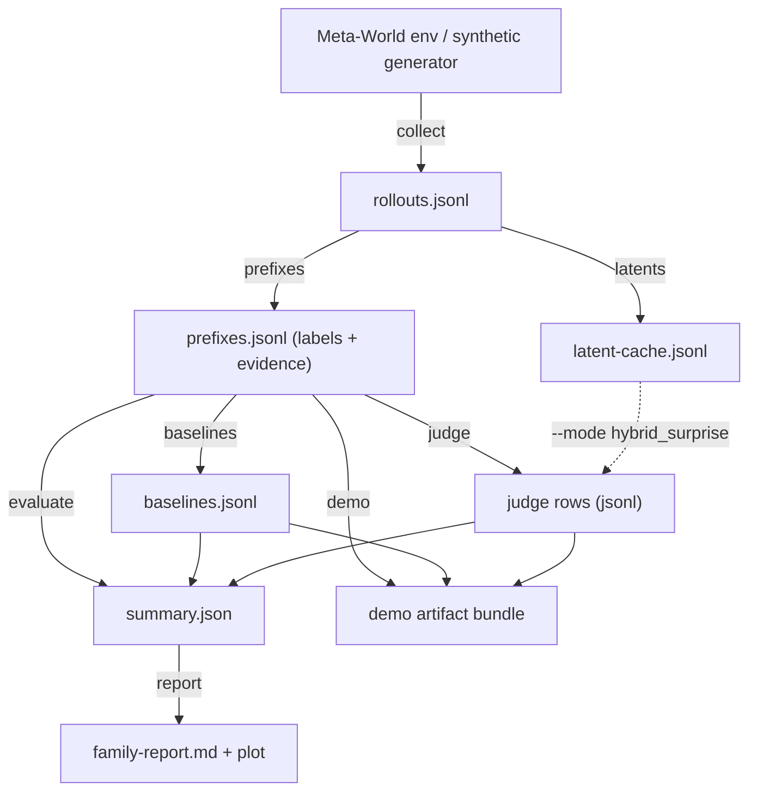

# Method

How the pipeline works: rollout capture, prefix construction, labeling, the two judge modes,
baselines, evaluation, and the honesty constraints that bind all of it. For what the numbers say,
see [benchmark.md](benchmark.md). For exact record schemas, see [contracts.md](contracts.md).

## Pipeline

Each arrow below is one CLI stage (`uv run lewm-judge <stage>`; also available as
`python -m leworldmodel_judge <stage>`). Every stage reads and writes plain files, so any
intermediate can be inspected or replayed without rerunning the rest.

## Module map

All logic lives in the `leworldmodel_judge` package (`src/leworldmodel_judge/`):

| Module | Responsibility |
|---|---|
| `schema.py` | `RolloutStep`, `PrefixRecord` dataclasses; `prefix_key` join helper |
| `tasks.py` | `LOCKED_TASKS` (`reach-v3`, `push-v3`, `pick-place-v3`) and task resolution |
| `collect.py` | policy-family registry, synthetic generator, Meta-World collection (lazy `metaworld` import) |
| `prefixes.py` | episode grouping, prefix slicing at fractional cutoffs, prefix evidence metrics |
| `labels.py` | task-specific failure / recoverability labeling (the most contested logic in the benchmark) |
| `baselines.py` | sparse-reward, terminal-success, and progress-proxy baseline scores |
| `latents.py` | observation-window latent cache: mean-pooled "latents" + linear-extrapolation predictor |
| `judge.py` | composite heuristic judge, hybrid latent judge, dummy judge; weight dataclasses |
| `metrics.py` | metric computation, calibration, family/task slicing, summary JSON |
| `report.py` | family report renderer (markdown + plot) |
| `demo.py` | demo artifact bundle: comparison CSV, disagreement pack, score replay, timeline plot |
| `plotting.py` | shared matplotlib guard (Agg) with SVG fallback primitives |
| `io.py` | JSONL/JSON read/write helpers |
| `cli.py` | `lewm-judge` argparse CLI, one subcommand per stage |

## Evidence signals

The prefix builder derives per-prefix evidence from Meta-World info fields (`obj_to_target`,
`in_place_reward`, `near_object`, `grasp_success`, `grasp_reward`, `success`, `unscaled_reward`):

- `progress_proxy` — distance progress where available, else an observation-based fallback
- `distance_progress`, `target_distance_start`, `target_distance_last`, `target_distance_best`
- `in_place_score`, `near_object_score`, `grasp_signal_peak`, `success_signal_peak`
- `reward_density` — mean non-negative unscaled reward over the prefix
- `stall_score` — inverse of distance progress (or reward density when distance is unavailable)

Missing signals stay `None`; they are never silently defaulted to zero. Zero is a legitimate
measured value, absence is not.

## Judge design

### Output contract

Every judge row emits four scores, defined precisely enough to benchmark:

- `on_track_score` — estimated likelihood that the rollout prefix is still consistent with
  successful completion
- `failure_score` — estimated likelihood that the trajectory is already effectively doomed or
  unrecoverable
- `implausibility_score` — estimated degree to which the observed prefix or predicted
  continuation appears off-manifold, physically inconsistent, or surprising under the
  world-model-derived representation
- `uncertainty_score` — how much the system trusts its own judgment

Guardrails:

1. A visually plausible score is not enough.
2. The score must be evaluated against task outcomes.
3. The score must be defined precisely enough to benchmark.
4. If uncertainty is emitted, it must not be confused with failure.

Each scored prefix emits a structured record with all raw sub-scores before any final
aggregation, plus a `judge_mode` tag naming the implementation that produced it.

### Composite heuristic judge (`judge_mode: composite_prefix_judge`)

CLI mode `heuristic_surprise`. A hand-weighted composite over the evidence signals above. It
first derives intermediate features — target proximity, distance regret (how far the object has
drifted back from its best distance), engagement (near-object or grasp), transport (in-place,
success, or distance progress), early patience (engaged early prefixes are forgiven), stalling
without transport, and engagement without transport — then combines them linearly and clips to
[0, 1]. The weights are hand-set constants held in frozen dataclasses in `judge.py`; that file is
the authority for exact values.

Two properties matter more than the weights:

- **The judge never reads labels.** `prefix_failure_label` and `prefix_recoverability_label` are
  not inputs; a regression test pins that flipping the labels leaves every score unchanged.
- **Every verdict decomposes.** Each row carries the evidence values the score was computed from
  (`progress_evidence`, `distance_progress_evidence`, `in_place_evidence`, `near_object_evidence`,
  `grasp_evidence`, `reward_evidence`, `stall_evidence`), so a reviewer can challenge a verdict
  record-by-record.

### Hybrid latent judge (`judge_mode: hybrid_prefix_latent_judge`)

CLI mode `hybrid_surprise`, consuming a latent cache built by `lewm-judge latents`. Honest
description of what the "latents" are today:

- the context latent is the **mean-pooled raw observation window** of the prefix
- the predicted future latent is a **linear extrapolation**: context mean plus the mean per-step
  delta scaled by the remaining horizon
- the actual future latent is the mean-pooled observations after the cutoff
- `latent_mismatch_score` / `latent_alignment_score` are the mean absolute gap between predicted
  and actual, clipped to [0, 1]

This is an observation-space placeholder for a learned JEPA encoder, not a learned representation.
The hybrid judge takes the composite row and adds mismatch pressure: high predicted-vs-actual
mismatch raises `failure_score`, `implausibility_score`, and `uncertainty_score` and lowers
`on_track_score`. If no cache row is available for a prefix, the hybrid mode degrades to the
composite score and the CLI warns. Because the actual future latent only exists once the episode
has been observed past the cutoff, the hybrid score is a hindsight consistency check — see the
next subsection. The upgrade path to a real learned latent is [roadmap.md](roadmap.md).

### Cutoff-time vs replay-time judging

The two real judge modes differ in *when* their scores can exist, and the difference is a
causality boundary, not an implementation detail:

- **Composite is cutoff-time.** It reads only prefix evidence, so its verdict is computable on a
  live partial rollout at the moment of the cutoff. It is the only cutoff-time judge in the repo
  today, and the headline held-out result is attributed to it
  (`summary-composite.json`).
- **Hybrid is replay-time.** `build_latent_cache` (`latents.py`) derives the actual future latent
  from `episode_steps[prefix_index:]` — the observations *after* the cutoff — so
  `latent_mismatch_score` requires the completed episode. The hybrid judge cannot emit a verdict
  at the cutoff; it is an offline replay/triage signal. This is the same standard by which
  `terminal_success_score` is excluded from the baseline comparison as "an oracle upper bound,
  not something available at the cutoff" (`baselines.py`).

On the checked-in held-out run the distinction costs nothing: the composite judge reproduces the
hybrid headline metrics exactly (`summary-composite.json` vs `summary.json`; thresholds 0.298006
vs 0.311141). Row by row, the latent feature raised `failure_score` by between +0.001 and +0.036
(mean +0.011) and changed no reported metric. Any early-verdict claim therefore rests on the
composite judge; the hybrid mode's value, if any, is in replay analysis until a predictor exists
that does not read the realized future ([roadmap.md](roadmap.md), Phase 2).

### Dummy judge (`judge_mode: dummy`)

A null judge (all scores 0.0, uncertainty 1.0) with the same record shape, kept so the evaluation
harness can be sanity-checked against a signal-free scorer.

## Labeling rules

Labels are heuristic, task-aware, and deliberately kept in one auditable module (`labels.py`).
Each prefix gets `prefix_failure_label` (bool: effectively doomed at this cutoff) and
`prefix_recoverability_label` (`recoverable` / `at_risk` / `doomed`). Rule shape:

- **Episodes that end in success are never failure-labeled**; their prefixes are `recoverable`
  when progress/in-place evidence is decent, else `at_risk`.
- **No observed state signal → `at_risk`**, never `doomed`. The labeler refuses to condemn a
  prefix it cannot see.
- **reach-v3**: doomed when a mid-or-late prefix shows near-zero distance progress while still
  far from target.
- **pick-place-v3**: doomed when a late prefix shows engagement (grasp/near-object) without
  transport while far from target; engagement with clear distance regret; or a mid-prefix with no
  contact, far from target, and weak reward evidence.
- **push-v3** (hardened 2026-04-28, the most benchmark-slippery task): doomed for late prefixes
  with almost no distance progress, still far from target, and weak transport; late prefixes with
  strong contact signals but clear distance regret and no useful transport; and medium/late
  prefixes with weak contact, low reward evidence, and persistent distance failure. This matters
  on real captures, where noisy contact-like signals can mask a dead trajectory if the label rules
  are too timid.

Exact numeric gates live in `labels.py` and are treated as benchmark-contract changes when
touched: relabeling shifts metrics, so label changes must ship with regenerated artifacts and a
note in the run provenance.

### Label circularity

The labeler and the judge consume the same evidence family — `distance_progress`,
`in_place_score`, `near_object_score`, `grasp_signal_peak`, `success_signal_peak`,
`reward_density`, `target_distance_last`/`target_distance_best`, `prefix_fraction`,
`progress_proxy` — and share constructed features: distance regret, engagement without
transport, and stall without transport appear both as label gates in `labels.py` and as failure
terms in `judge.py`. The labels are heuristics over judge inputs, not independent ground truth;
only `final_success_label` is environment truth, and it only vetoes failure labels on successful
episodes.

The consequence is that judge-vs-label agreement is partly built in by construction. Calibrated
honestly: a single shared-family feature — distance regret alone, ranked with the same
tie-handled pairwise statistic — scores pairwise 0.985 on the synthetic slice (the judge's own
headline there) and 0.825 on the held-out evaluation slice (judge: 1.0), computed from the
checked-in `prefixes.jsonl` files. The non-circular content of the results is (a) the
final-success environment truth, and (b) the threshold transferring across disjoint policy
families in the held-out run. Labels that are independent of the judge's evidence family (human
annotation, or environment-defined failure states) are roadmap work, not shipped.

## Calibration protocol

The failure threshold applied to `failure_score` must state its provenance in every summary:

- **fixed** — chosen before looking at the current slice
- **in-slice** — tuned on the same slice being reported (balanced accuracy over that slice);
  acceptable for debugging, never presented as a deployment operating point
- **held-out** (`held_out_family_split`) — tuned on a disjoint calibration cohort of policy
  families, then evaluated on the reported families

For held-out runs, the summary must name which families calibrated the threshold, which families
were evaluated, and how many failure / non-failure prefixes each cohort contained.
`held_out_family_split` is only valid when the calibration and evaluation families are disjoint;
if they overlap, the evaluator falls back to in-slice semantics instead of pretending the
threshold is held-out.

## Key invariants

1. The judging task is defined before implementation drift begins.
2. All judge outputs are benchmarked against sparse reward.
3. Baseline signals and judge signals remain explicitly separated.
4. V1 claims stay narrower than the architecture's future potential.
5. The benchmark contract survives implementation swaps.

## Main architectural risk

The largest architectural risk is confusing the conceptual anchor with the v1 implementation.
Mitigation: LeWorldModel remains the strategic thesis anchor; the judge interface remains
implementation-agnostic; v1 ships with a lighter heuristic judge on the world-model-anchored
path; and the benchmark contract stays stable regardless of implementation swap.

## Honesty constraints

- The demo artifact states explicitly that the current system is a verifier-style judging
  surface, not yet a faithful JEPA world model implementation.
- Wherever numbers appear, `judge_mode` provenance appears with them.
- Heuristics are never laundered behind JEPA branding: the composite judge is called a heuristic,
  and the latent proxy is called a proxy.

## Related docs

- [vision.md](vision.md) — thesis and claim discipline
- [benchmark.md](benchmark.md) — contract, results, reproduction
- [contracts.md](contracts.md) — record schemas and CLI surface
- [roadmap.md](roadmap.md) — path from heuristic proxy to JEPA-faithful judging
- [rfcs/](rfcs/README.md) — decision log
